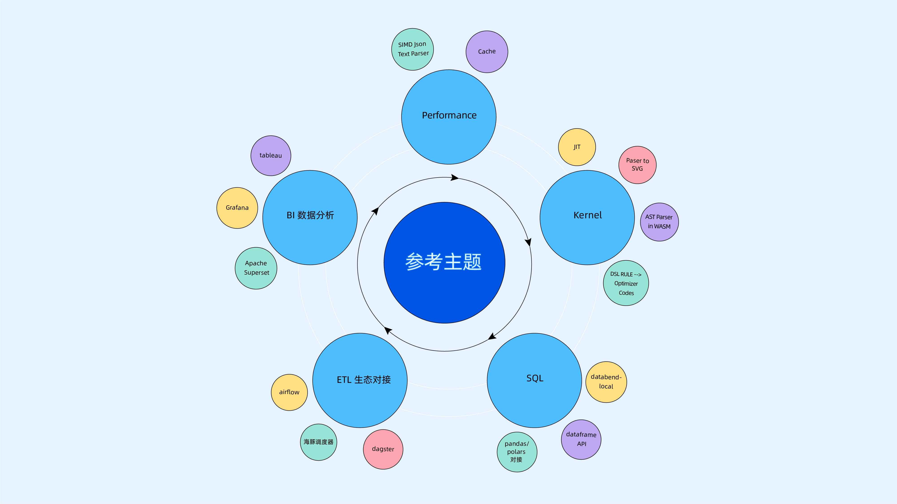

# Databend x Rust China Hackathon 2022

***Rust China Hackathon 2022 线上活动***

首届 Rust China Hackathon Online 来啦！本届 Hackathon 主题为「Rust for Fun」，期待与你一起用 Rust 释放创新的更多可能性。

本届 Hackathon 将面向更广泛人群，分为 「社区组」与 「企业组」两大赛道。无论你是应用开发者、游戏开发者、云原生开发者，还是嵌入式开发者，都可以找到适合自己的方向，一起“玩转”Rust。

本届 Hackathon 报名通道于 2022 年 11 月 15 日正式开启，选手们可以自行组队参赛，通过初赛甄选后，将在线上完成 路演与决赛答辩，优胜队伍将获得奖金、企业直聘通道等支持。

**报名入口：https://shimo.im/forms/NJkbE55P5WFLz7qR/fill**

---

Databend 作为本届 Hackathon 的协办方，赞助参与本次企业组赛道，参赛选手可以围绕 Databend 组件或 Databend 生态周边进行创作，共同探索云原生数仓的魅力。

## 赛题说明

为了进一步丰富和提高 Databend 的能力，拓展 Databend 周边生态，参赛选手可以围绕 BI 数据分析、ETL 生态对接等主题做出贡献，也可以尝试从 SQL 能力拓展、内核功能增强、性能提高等角度 Hack 一把。

## 奖金安排

- 一等奖：1 组，20000 元奖金+ 限量大礼包 + 社区访谈 + 企业直聘通道
- 二等奖：1 组，10000 元奖金 + 限量大礼包 + 企业直聘通道
- 三等奖：1 组，5000 元奖金 + 限量大礼包
- 最佳参与奖：5 组 ，限量大礼包

> 奖金以税前人民币计，所获奖项和奖励会根据实际表现授予，可能会出现奖项轮空的情况。最终解释权归 Datafuse Labs 所有。

## 赛程安排

- 报名 + 组队：11.15 ～ 12.12 
- 组委会整理报名资料：12.12 ～ 12.14
- 开发：12.15 ～ 12.18 
- 作品提交：12.19 
- 作品初评：12.20 ～ 12.25
- 大赛线上路演：12.29
- 作品颁奖：12.30

## 评审标准

选手需围绕选定主题做出一个完整的作品并由评审最终评选出获奖者。

根据黑客松的规则，需要有使用 Rust 编程语言。

评委将根据选手的提交，从新颖度、完成度、实用度这三个角度进行评审。

## 组队须知

允许 1 - 5 人组队参赛，只要你对开源和技术心怀热爱，即可报名参赛。

> 每人只限参加一个团队。组委会将会对每个参赛人员进行审核。

## 作品提交

请按照赛程规定时间提交至此 GitHub Repo 下。

## 注意事项

1. 第一行代码 commit 的时间不得早于 12 月 14 日 23:59 ，否则即视为违规，取消参赛资格。
2. 每个项目一个独立目录提交。

## 联系方式

如有疑问，可邮件联系 <psiace@datafuselabs.com>
