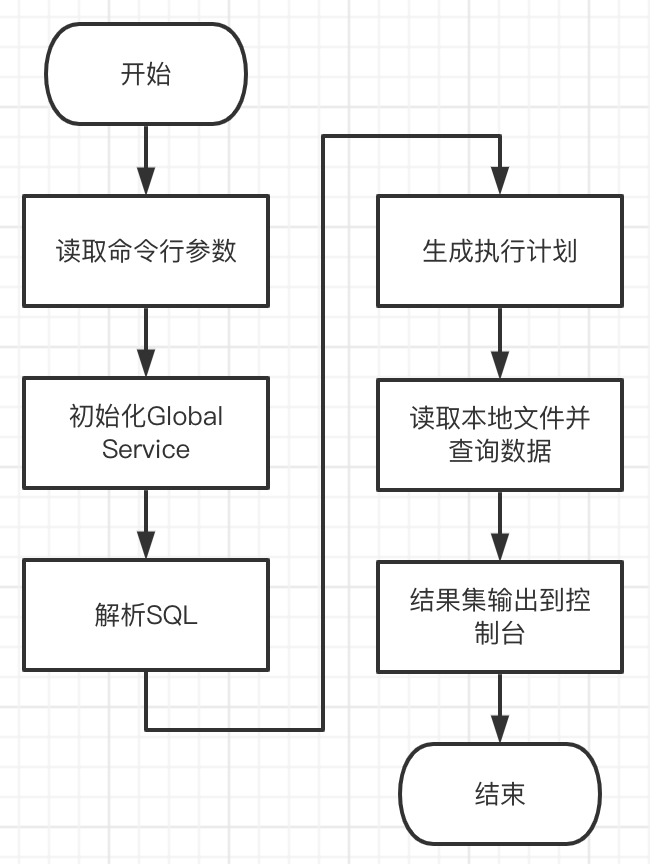

# databend-local

## 团队简介

队名：我也要吃螃蟹

队员：[eastfisher](https://github.com/eastfisher)

## 项目设计

### 背景

有时我们需要使用 SQL 语言分析本地数据文件，在享受 SQL 语言简洁、强大的分析能力的同时，又希望查询性能尽可能高。传统的一些基于 Python 的 SQL 查询工具性能较差，对大型数据文件、复杂 SQL 显得力不从心。Databend 作为新一代云原生数据仓库，在查询性能、运维复杂度方面有着较大优势。然而目前的情况是，要使用 Databend 必须先搭建一套 Databend 集群（或者使用 Databend Cloud），然后用 Client 连接到集群进行查询，这对于本地文件分析有些“牛刀割鸡”了。在这方面，OLAP 先驱 ClickHouse 提供了一个很好的思路：将最核心的查询引擎剥离出来，做成一个命令行工具（就是 [clickhouse-local](https://clickhouse.com/docs/zh/operations/utilities/clickhouse-local/)），在不启动集群的情况下执行本地文件分析。目前 Databend 还没有类似的功能，那么这次 Hackathon 我们就来撸一个 databend-local 试试。

### 设计

参考 `query` 节点从启动初始化到通过 HTTP 请求接收 SQL 并执行的整个流程，来设计一个精简的 local 处理流程。



`query` 的 GlobalServices 里面有一些是 `local` 用不到的 （如 ClusterDiscovery、DataExchangeManager），`local` 初始化可以精简一下。

## 代码实现

提交到 databend 代码仓库。

https://github.com/datafuselabs/databend/pull/9282

## Demo

### 基本功能

```bash
> export CONFIG_FILE=tests/local/config/databend-local.toml
> cargo run --bin=databend-local -- --sql="SELECT * FROM tbl1" --table=tbl1=/path/to/databend/docs/public/data/books.parquet

sql: SELECT * FROM read_parquet('/path/to/databend/docs/public/data/books.parquet')
+--------------------------------+-----------------------+--------+
| title                          | author                | date   |
+--------------------------------+-----------------------+--------+
| "Transaction Processing"       | "Jim Gray"            | "1992" |
+--------------------------------+-----------------------+--------+
| "Readings in Database Systems" | "Michael Stonebraker" | "2004" |
+--------------------------------+-----------------------+--------+
| "Transaction Processing"       | "Jim Gray"            | "1992" |
+--------------------------------+-----------------------+--------+
| "Readings in Database Systems" | "Michael Stonebraker" | "2004" |
+--------------------------------+-----------------------+--------+
4 rows in set (0.0163 sec)
```

### 性能测试

TODO: 对比 clickhouse-local, dsq
